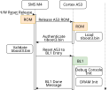
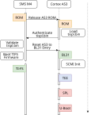
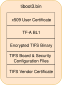
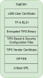
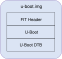

.. SPDX-License-Identifier: GPL-2.0+ OR BSD-3-Clause
.. sectionauthor:: Bryan Brattlof <bb@ti.com>

AM62Lx Platforms
================

The AM62L is a lite, low power and performance optimized family
of application processors that are built for Linux application
development. The AM62L is well suited for a wide range of
general-purpose applications with scalable ARM Cortex-A53 core
performance and embedded features such as: Multimedia DSI/DPI support,
integrated ADC on chip, advanced lower power management modes, and
extensive security options for IP protection with the built-in security
features.

The AM62L is a general purpose processor, however some of the
applications well suited for it include: Human Machine Interfaces (HMI),
Medical patient monitoring , Building automation, Smart secure gateways,
Smart Thermostats, EV charging stations, Smart Metering, Solar energy
and more.

Some highlights of AM62L SoC are:

- Single to Dual 64-bit Arm® Cortex®-A53 microprocessor subsystem up to
  1.25GHz Integrated Giga-bit Ethernet switch supporting up to a total
  of two external ports

- 16-bit DDR Subsystem that supports LPDDR4, DDR4 memory types.

- Display support: 1x display support over MIPI DSI (4 lanes DPHY) or
  DPI (24-bit RGB LVCMOS)

- Multiple low power modes support, ex: Deep sleep and Standby

- Support for secure boot, Trusted Execution Environment (TEE) &
  Cryptographic Acceleration

For more information check out our `Technical Reference Manual (TRM)`_.

.. _Technical Reference Manual (TRM): https://www.ti.com/lit/ug/sprujb4/sprujb4.pdf

Boot Flow:
----------

The AM62Lx SoCs deviate significantly from the typical boot-flow of the
other Sitara or Jacinto class of SoCs.

The first CPU released on power on will be the Security Management
Subsystem (SMS) MCU to first secure the device like all other K3 SoCs.
However because the lack of any MCU cores the boot ROM is located on one
of the A53 cores which is responsible for loading TI's root-of-trust
firmware (TIFS) along with a BL1 image generated from the
ARM-Trusted-Firmware repository. The BL1 image is responsible for
initializing the debug console, the DDR controller, and speeding up the
A53 to it's maximum allowable.

Once the BL1 is done, it will send a message back to the SMS core to
reset and begin the second boot phase.

For the second boot phase, with DDR active ROM can now load the larger
images contained in the tispl.bin (or whatever filename or offset was
configured during the BL1 boot phase) which contains TI's root-of-trust
firmware (TIFS) along with OP-TEE, TF-A's BL31 and U-Boot SPL images to
initialize the root-of-trust, and the TrustZone and normal world for the
A53s.

From there the U-Boot SPL will load and authenticate U-Boot proper.

Sources:
--------

.. include::  ../ti/k3.rst
    :start-after: .. k3_rst_include_start_boot_sources
    :end-before: .. k3_rst_include_end_boot_sources

Build procedure:
----------------

0. Setup the environment variables:

   .. include::  ../ti/k3.rst
       :start-after: .. k3_rst_include_start_common_env_vars_desc
       :end-before: .. k3_rst_include_end_common_env_vars_desc

   .. include::  ../ti/k3.rst
       :start-after: .. k3_rst_include_start_board_env_vars_desc
       :end-before: .. k3_rst_include_end_board_env_vars_desc

   Set the variables corresponding to this platform:

   .. include::  ../ti/k3.rst
       :start-after: .. k3_rst_include_start_common_env_vars_defn
       :end-before: .. k3_rst_include_end_common_env_vars_defn

   .. prompt:: bash $

      export UBOOT_CFG_CORTEXA=am62lx_evm_defconfig
      export TFA_BOARD=am62lx-evm
      export OPTEE_PLATFORM=k3-am62lx

1. Build Trusted Firmware-A:

   More detailed porting and build guide can be found in the `TF-A
   documentation`_ for all AM62L based platforms. For the AM62L-EVM the
   build command will be:

   .. prompt:: bash $

      make CROSS_COMPILE=aarch64-none-linux-gnu- \
            ARCH=aarch64 \
            PLAT=k3low \
            TARGET_BOARD=$TFA_BOARD

.. _TF-A documentation: https://trustedfirmware-a.readthedocs.io/en/latest/plat/ti-k3low-am62lx.html

#. Build OP-TEE:

   Depending on the application more build arguments may be needed. The
   `OP-TEE documentation`_ has more information on this. The basic build
   commands for the AM62L-EVM are:

   .. prompt:: bash $

      make CROSS_COMPILE=$CC32 \
            CROSS_COMPILE64=$CC64 \
            CFG_ARM64_core=y \
            $OPTEE_EXTRA_ARGS \
            PLATFORM=$OPTEE_PLATFORM

.. _OP-TEE documentation: https://optee.readthedocs.io/en/latest/

#. Build U-Boot:

   .. prompt:: bash $

      make $UBOOT_CFG_CORTEXA
      make CROSS_COMPILE=aarch64-linux-gnu- \
            BINMAN_INDIRS="$LNX_FW_PATH" \
            TEE="$OPTEE_PATH/out/arm-plat-k3/core/tee-raw.bin" \
            BL1="$TFA_PATH/build/k3low/$TFA_BOARD/release/bl1.bin" \
            BL31="$TFA_PATH/build/k3low/$TFA_BOARD/release/bl31.bin"

Image formats:
--------------

The final images generated and needed for booting the AM62L are:

- tiboot3.bin

- tispl.bin

- u-boot.img

Switch Setting for Boot Mode
----------------------------

Boot Mode pins provide means to select the boot mode and options before the
device is powered up. After every POR, they are the main source to populate
the Boot Parameter Tables.

The following table shows some common boot modes used on AM62L-EVM

.. list-table::
   :widths: 16 16 8 8
   :header-rows: 1

   * - Switch Label
     - SW4: 12345678
     - SW2: 1234
     - SW3: 1234

   * - EMMC
     - 11010010
     - 0000
     - 0000

   * - SD
     - 11000010
     - 0100
     - 0000

   * - UART
     - 11011100
     - 0000
     - 0000

   * - USB DFU
     - 11001010
     - 0000
     - 0000

Debugging U-Boot
----------------

See :ref:`Common Debugging environment - OpenOCD<k3_rst_refer_openocd>`: for
detailed setup information.

.. include::  k3.rst
    :start-after: .. k3_rst_include_start_openocd_connect_XDS110
    :end-before: .. k3_rst_include_end_openocd_connect_XDS110

To start OpenOCD and connect to the board

.. prompt:: bash

   openocd -f board/ti/am62levm.cfg
